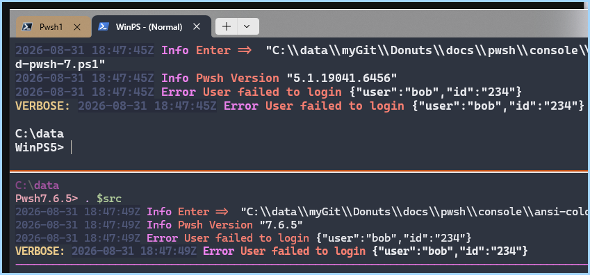
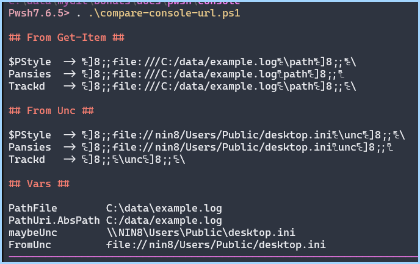

**Examples**

- [Ansi colors on Powershell 5 and 7](#ansi-colors-on-powershell-5-and-7)
- [Compare Console Urls](#compare-console-urls)

# Ansi colors on Powershell 5 and 7



- From: [Ansi colors in Windows Powershell 5 and Pwsh 7.ps1](ansi-colors-windows-powershell-5-and-pwsh-7.ps1)

> [!TIP]
> You can [visualize the escapes with `ShowCc`](compare-console-url.ps1)

```powershell
> 'hi world' | New-Text -fg '#feaa99' -bg 'darkred' | ShowCc

  -> ␛[48;2;139;0;0m␛[38;2;254;170;153mhi world␛[49m␛[39m
```

# Compare Console Urls


- From [Compare Console URL.ps1](compare-console-url.ps1)