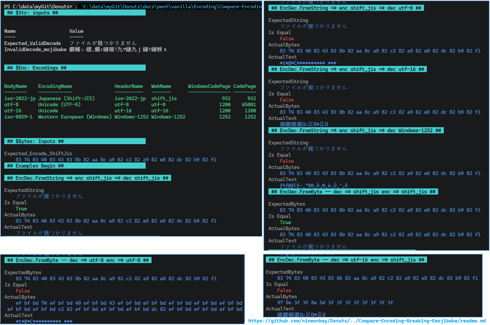
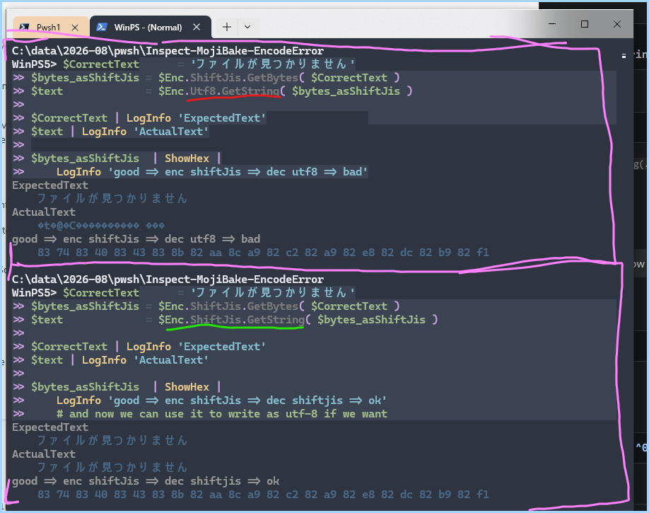

- [Visualize Encoding Errors](#visualize-encoding-errors)
- [Examples](#examples)
  - [Direct mode](#direct-mode)
  - [Start from a String](#start-from-a-string)
  - [Start from `Byte[]`s array](#start-from-bytes-array)
- [Troubleshooting and tips](#troubleshooting-and-tips)
  - [Save `UTF8` as `UTF8WithBOM`](#save-utf8-as-utf8withbom)
- [Tangents](#tangents)

# Visualize Encoding Errors

<small>Grab the script: [Compare-Encode-Decode-Errors-on-Powershell-5.1.ps1](Compare-Encode-Decode-Errors-On-PowerShell-5.1.ps1)</small>




# Examples

## Direct mode

*Dotsource it*

```powershell
. ./Compare-Encode-Decode-Errors-On-PowerShell-5.1.ps1

$enc.Utf8.GetString( $enc.Utf8.GetBytes( '🐒' ))
# prints: '🐒'

$enc.Utf8.GetBytes( '🐒' ) | ShowHex
# prints: 'f0 9f 90 92'
```



To inspect `$Enc` names
```powershell
Encoding.Summary
```

| HashKey  | BodyName    | EncodingName               | HeaderName   | WebName      | WindowsCodePage | CodePage |
| -------- | ----------- | -------------------------- | ------------ | ------------ | --------------- | -------- |
| ShiftJis | iso-2022-jp | Japanese (Shift-JIS)       | iso-2022-jp  | shift_jis    | 932             | 932      |
| Utf8     | utf-8       | Unicode (UTF-8)            | utf-8        | utf-8        | 1200            | 65001    |
| Utf16le  | utf-16      | Unicode                    | utf-16       | utf-16       | 1200            | 1200     |
| Default5 | iso-8859-1  | Western European (Windows) | Windows-1252 | Windows-1252 | 1252            | 1252     |


## Start from a String

Take the string `'ファイルが見つかりません'` and compare

- encode: as `ShiftJis` then decode as `ShiftJis` ( Works )
- encode: as `ShiftJis` then decode as `Utf8` ( Breaks )

----


```powershell
$Text = 'ファイルが見つかりません'
# good -> enc ShiftJis -> dec ShiftJis -> good
# good -> enc ShiftJis -> dec Utf8     -> bad
CompareEncDec.FromString -EncodeAs $Enc.ShiftJis -DecodeAs $Enc.ShiftJis -FromString $Text 
CompareEncDec.FromString -EncodeAs $Enc.ShiftJis -DecodeAs $Enc.Utf8     -FromString $Text 
```
<!-- ( $HexString = $Enc.Utf8.GetBytes(  '🐒' )  | ShowHex ) 
$curBytes = Bytes.FromHexStr $HexString
CompareEncDec.FromByte -Bytes $ExpectBytes_Encoded_ShiftJis -DecodeAs $enc.Utf8 -EncodeAs $enc.Utf8 -->
<!-- $ExpectBytes_Encoded_ShiftJis = Bytes.FromHexStr '83 74 83 40 83 43 83 8b 82 aa 8c a9 82 c2 82 a9 82 e8 82 dc 82 b9 82 f1'

CompareEncDec.FromByte -Bytes $ExpectBytes_Encoded_ShiftJis -DecodeAs $enc.Utf8 -EncodeAs $enc.Utf8
CompareEncDec.FromByte -Bytes $ExpectBytes_Encoded_ShiftJis -DecodeAs $Enc.Utf16Le -EncodeAs $Enc.ShiftJis -->

## Start from `Byte[]`s array

This time I have 
```powershell
( $HexString = $Enc.Utf8.GetBytes(  '🐒' )  | ShowHex ) 
$curBytes = Bytes.FromHexStr $HexString

# good -> dec utf8 -> enc utf8 -> good
# good -> dec ut16le -> enc utf8 -> bad
CompareEncDec.FromByte -Bytes $curBytes -DecodeAs $enc.Utf8 -EncodeAs $enc.Utf8
CompareEncDec.FromByte -Bytes $curBytes -DecodeAs $enc.Utf16le -EncodeAs $enc.Utf8
```

# Troubleshooting and tips

## Save `UTF8` as `UTF8WithBOM`

> [!IMPORTANT]
> If you copy the code, make sure you save the file as `UTF8WithBOM` . Then `PowerShell.exe` will automatically support `utf-8` string literals in the source file itself ( In `Powershell 5.1` )

That enables `PowerShell.exe -File 'somefile.ps1'`

> [!NOTE]
> Encoding occur when **mixing** the wrong `encodings`. This can occur in any language.
> However the defaults Powershell 5.1 make it a little harder to deal with than pwsh 7 or other languages.

Think of encoding files like translating a book **to spanish**. Then **reading it as english**, *without translating* it. 
- Some words are exactly the same like "no" and "club"
- Lots of words are partially broken or out of order


# Tangents
<details><summary><small>If you like Tangents... 🦝</small>

</summary>

- [about_Character_Encoding](https://learn.microsoft.com/en-us/powershell/module/microsoft.powershell.core/about/about_character_encoding) lists the different default encodings when using 5 vs 7

Official Unicode Specifications
- [Unicode top level docs](https://www.unicode.org/standard/standard.html)
- [Core Specs: Version 17.0](https://www.unicode.org/versions/Unicode17.0.0/core-spec/)
- [Core Specs FAQ](https://www.unicode.org/faq/specifications.html)

Wikipedia
- [UTF-16](https://en.wikipedia.org/wiki/UTF-16)
- [`BOM` - Byte Order Mark](https://en.wikipedia.org/wiki/Byte_order_mark)
- [Shift JIS Encoding](https://en.wikipedia.org/wiki/Shift_JIS)
- [Common Character Encodings](https://en.wikipedia.org/wiki/Character_encoding#Common_character_encodings)

Microsoft
- [Code Pages: win32/intl](https://learn.microsoft.com/en-us/windows/win32/intl/code-pages)

</details>
